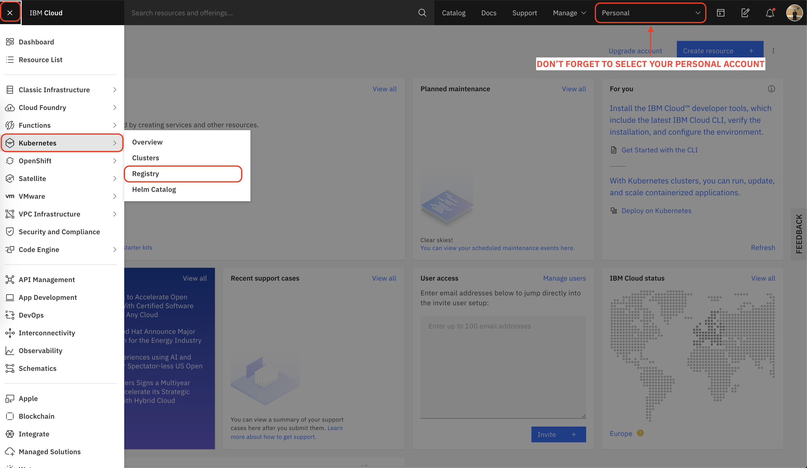

# Creating Pipelines

## Create your container registry



1. After you open the Registry page, select the region as **Dallas**.
2. Go to the **Namespaces** tab.
3. Click to **Create** button, and name it `jenkins-workshop-<unique-name>` .Namespace names should be unique across the region. 

## Create apikey for container registry

1. Go to **Cloud Shell Tab.** Click to `+` sign to open a new session.
2. Look on the top right and be sure that
   1. Location is **Dallas**
   2. Current account is **your personal account \(not DevAdv account\)**
   3. If it is not, login with `ibmcloud login -a cloud.ibm.com -r us-south` then enter your ibm cloud email and password. Select the first account \(your personal account, the one does not includes IBM\)
3. Enter `ibmcloud target` to be sure. You should see your personal account's name and us-south region.
4. Enter `ibmcloud iam api-key-create container-registry-key`
5. Copy the apikey and note it to a notepad. \(write **container registry** to not forget for which task you created it\)
6. The infos we will need are:
   1. us-south for region \(us.icr.io\)
   2. jenkins-workspace as namespace name
   3. apikey to access registry

## Create apikey for kubernetes access

1. Open new terminal session 
2. login with `ibmcloud login -a cloud.ibm.com -r us-south` then enter your ibm cloud email and password again. This time select **IBM provided account**.
3. Enter `ibmcloud iam api-key-create container-registry-key`
4. Copy the apikey and note it to a notepad. \(write **kubernetes** to not forget for which task you created it\)

## Create kubernetes secrets

We will need 3 secrets to use in our pipeline

* Secret for **pushing to container registry**
* Secret for **kubernetes deployment**
* Secret for **pulling image to kubernetes**

Open a new terminal in IBM Cloud shell.

Check targeted account, if it is the one provided from IBM, you don't need to login. If it is not, login as explained above.

Access to your cluster as explained in [here](deploying-jenkins.md#access-to-your-cluster).

### To create the secret for pushing images:

This secret will be used when configuring private registry access in jenkins job.

```bash
kubectl create secret generic icr-apikey \
  --from-literal apikey=<replace_your_api_key_for_registry> --namespace jenkins
```

### To create secret for kubernetes deployment

This secret will be used when configuring kubernetes cluster in jenkins job.

```bash
kubectl create secret generic ibmc-apikey \
  --from-literal apikey=<replace_your_api_key_for_kubernetes> --namespace jenkins
```

### To create secret for pulling images

This secret will be added to default namespace and will be use inn pod template. When pod tries to pull the image from your private registry, it will use this secret.


It is important to **not** change the secret name, otherwise, deployment.yml should change too.


```bash
kubectl create secret docker-registry icr-pull
        --docker-server=us.icr.io \
        --docker-username=iamapikey \
        --docker-password=<replace_your_api_key_for_registry> \
        --docker-email=<replace_your_ibm_cloud_email>
```

## Login to Jenkins

Go to Jenkins server tab that we have opened in the first section. If you have closed accidentally, Open you IBM Cloud Shell tab, press the `eye` button and then click to 8080.

* Username is : `admin`
* Password is : you have wrote it down in the first section.

## Create a new pipeline

1. On the left menu, you will see **New Item.** Click on that item.
2. Enter your pipeline name.
3. Select **Pipeline** item below
4. Click OK.
5. The options on the pipelines are not these workshop's topic. Scroll down to **Pipeline** section.

Here we will write our Jenkins script.

Since we are using Kubernetes, we will use kubernetes plugin. This is already installed and configured. We will check it after creating the pipeline.

### First of all, we will define a **PodTemplate**. 

This template will describe the pod that will be created by Jenkins.

```javascript
podTemplate(
    cloud: 'kubernetes', 
    label: 'workshop',
    containers: [
        containerTemplate(
            name: 'nodejs', 
            image:'node:alpine', 
            ttyEnabled: true, 
            alwaysPullImage: false
        ),
        containerTemplate(
            name: 'build',
            image: 'volaka/ibm-cloud-cli:1.2.1',
            ttyEnabled: true,
            alwaysPullImage: false,
            envVars: [
                secretEnvVar(
                    key: 'REGISTRY_TOKEN', 
                    secretName: 'icr-apikey', 
                    secretKey: 'apikey'
                )
            ]
        ),
        containerTemplate(
            name: 'deploy',
            image: 'volaka/ibm-cloud-cli:1.2.1',
            ttyEnabled: true,
            alwaysPullImage: false,
            envVars: [
                secretEnvVar(
                    key: 'IBMCLOUD_TOKEN', 
                    secretName: 'ibmc-apikey', 
                    secretKey: 'apikey'
                )
            ]
        ),
    ],
    volumes: [
        hostPathVolume(
            mountPath: '/var/run/docker.sock', 
            hostPath: '/var/run/docker.sock'
        )
    ]
)
```

1. **Cloud:** kubernetes. This is preconfigured for us in the jenkins installation. We will show this configuration after the pipeline.
2. **Label**: This is the tracking mechanism in Jenkins. We will target this pod later in the pipeline using this label.
3. **Containers:** this is the section we define containers in the pod. It uses **ContainerTemplate** 
4. **volumes:** Volume binding configuration in kubernetes pod spec. Binding docker socket to pod so we can build docker containers in build stage.

### Targeting the pod and tell Jenkins to create a pod

```javascript
podTemplate(...)
{
    node('workshop') {
        ...
    }
}
```

**`node`** script tells jenkins to target a pod. `"workshop"` is the label that we want jenkins to create for this pipeline. 

### Now, we will create our Test stage

```javascript
podTemplate(...)
{
    node('workshop') {
        stage('Test') {
            git url: 'https://github.com/volaka/jenkins-nodejs-app.git'
            container('nodejs') {
                sh 'npm install'
                sh 'npm run test'
            }
        }
    }
}
```

1. stage: we define the stage name here.
2. git url: this script helps us to clone the git repo to our workdir.
3. container: we tell which container will be used for this stage. this is one of the containers we defined in podTemplate. We use the name info of the container

### Now let's add Build Stage

```javascript
podTemplate(...)
{
    node("workshop") {
        stage('Test') {
            ...
        }
        stage('Build') {
            git url: 'https://github.com/volaka/jenkins-nodejs-app.git'
            container('build') {
                sh 'ibmcloud login -a cloud.ibm.com -r us-south --apikey ${REGISTRY_TOKEN}'
                sh 'ibmcloud cr login'
                sh 'ibmcloud cr build -t us.icr.io/<replace_your_namespace/<replace_your_image_name>:${BUILD_ID} .'
            }
        }
    }
}
```

In this container, we are using a special container created for ibmcloud cli automation. More detailed info is [here](https://hub.docker.com/r/volaka/ibm-cloud-cli).

1. `sh 'ibmcloud login -a cloud.ibm.com -r` **`us-south`** `--apikey ${REGISTRY_TOKEN}'`  just be sure with the region. This region is the one your container registry is created in.
2. `sh 'ibmcloud cr build -t` **`us.icr.io`**`/volaka/application:${BUILD_ID} .'`  just be sure with the registry address. You can find more information about regions and urls in [container registry docs.](https://cloud.ibm.com/docs/Registry?topic=Registry-registry_overview#registry_regions)

### Now let's Deploy our application to Kubernetes

```javascript
podTemplate(...)
{
    node("workshop") {
        stage('Test') {
            ...
        }
        stage('Build') {
            ...
        }
        stage('Deploy') {
            git url: 'https://github.com/volaka/jenkins-nodejs-app.git'
            container('deploy') {
                sh 'ibmcloud login -a cloud.ibm.com -r us-south --apikey ${IBMCLOUD_TOKEN}'
                sh 'ibmcloud ks cluster config --cluster <replace_your_cluster_name>'
                sh 'sed -i "s~^\\([[:blank:]]*\\)image:.*$~\\1image: us.icr.io/<replace_your_namespace>/<your_application_name>:${BUILD_ID}~" deployment.yml'
                sh 'kubectl apply -f deployment.yml -n default'
                sh 'kubectl get svc -n jenkins'
            }
        }
    }
}
```

1. Don't forget to check your region in login command. This is the region your kubernetes cluster is created in.
2. Replace your cluster name in the second command.
3. Check those parameters in third command. sed command replaces the appropriate line with your image name.
   1. us.icr.io \(your image registry, where you pushed in build stage\)
   2. your registry namespace
   3. your application name.
4. Fourth command applies the [deployment.yml](https://github.com/volaka/jenkins-nodejs-app/blob/master/deployment.yml) to your kubernetes cluster and deploys your application.

### Final version of the file

You should have something similar to the following file

```javascript
podTemplate(
    cloud: 'kubernetes', 
    label: 'workshop',
    containers: [
        containerTemplate(
            name: 'nodejs', 
            image:'node:alpine', 
            ttyEnabled: true, 
            alwaysPullImage: false
        ),
        containerTemplate(
            name: 'build',
            image: 'volaka/ibm-cloud-cli:1.2.1',
            ttyEnabled: true,
            alwaysPullImage: false,
            envVars: [
                secretEnvVar(
                    key: 'REGISTRY_TOKEN', 
                    secretName: 'icr-volaka', 
                    secretKey: 'apikey'
                )
            ]
        ),
        containerTemplate(
            name: 'deploy',
            image: 'volaka/ibm-cloud-cli:1.2.1',
            ttyEnabled: true,
            alwaysPullImage: false,
            envVars: [
                secretEnvVar(
                    key: 'IBMCLOUD_TOKEN', 
                    secretName: 'ic20', 
                    secretKey: 'apikey'
                )
            ]
        ),
    ],
    volumes: [
        hostPathVolume(
            mountPath: '/var/run/docker.sock', 
            hostPath: '/var/run/docker.sock'
        )
    ]
)
{
    node('workshop') {
        stage('Test') {
            git url: 'https://github.com/volaka/jenkins-nodejs-app.git'
            container('nodejs') {
                sh 'npm install'
                sh 'npm run test'
            }
        }
        stage('Build') {
            git url: 'https://github.com/volaka/jenkins-nodejs-app.git'
            container('build') {
                sh 'ibmcloud login -a cloud.ibm.com -r eu-de --apikey ${REGISTRY_TOKEN}'
                sh 'ibmcloud cr login'
                sh 'ibmcloud cr build -t de.icr.io/volaka/jenkins-app:${BUILD_ID} .'
            }
        }
        stage('Deploy') {
            git url: 'https://github.com/volaka/jenkins-nodejs-app.git'
            container('deploy') {
                sh 'ibmcloud login -a cloud.ibm.com -r eu-de --apikey ${IBMCLOUD_TOKEN}'
                sh 'ibmcloud ks cluster config --cluster volaka-k8s'
                sh 'sed -i "s~^\\([[:blank:]]*\\)image:.*$~\\1image: de.icr.io/volaka/jenkins-app:${BUILD_ID}~" deployment.yml'
                sh 'kubectl apply -f deployment.yml -n default'
                sh 'kubectl get svc -n jenkins'
            }
        }
    }
}
```

### Let's control our application

Go to your Kubernetes Cluster overview page in IBM Cloud Web.


Select your cluster. 


If you don't see any clusters, check your account from top left and be sure that you are not in your personal account.



Go to worker nodes tab from the left menu and copy the public ip.

Open the **Kubernetes Dashboard** to look for the service port.


In my case, I can access to my application via **`169.50.53.68:31978`** 

