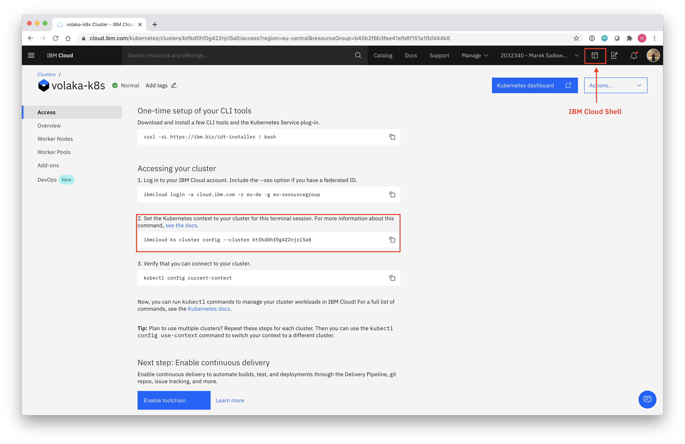

# Deploying Jenkins

## Access to your cluster



On third 2nd step, you can see a shell command to config your cluster on your workspace. You can click to the **IBM Cloud Shell** button on top right and open a shell workspace connected to your cloud environment.

Then you can copy the config command and paste it to your terminal and press enter.


## Deploy Jenkins

First, we need to create a **namespace** for Jenkins pods to deploy.

```bash
kubectl create namespace jenkins
```

Then we need to create a **values.yaml** file for jenkins helm chart to read. This file will customize our Jenkins deployment.

* **storageClass:** this config sets the storage class which kubernetes will use when provisioning a persistent volume.
* **master.customInitContainers:** this config sets a new initContainer that runs before the jenkins master and sets the ownership of the binded volume. Without this manipulation, Jenkins will not be able to write to persistent storage.

```bash
cat << EOF > values.yaml
storageClass: ibmc-file-bronze
master:
  customInitContainers:
    - name: "volume-mount-permission"
      image: "busybox"
      command: ["/bin/chown", "-R", "1000", "/var/jenkins_home"]
      volumeMounts:
        - name: "jenkins-home"
          mountPath: "/var/jenkins_home"
      securityContext:
        runAsUser: 0
EOF
```

Deploy Jenkins with the next command. It will take approximately 5-6 minutes.

```bash
kubectl create serviceaccount tiller -n kube-system && \
kubectl create clusterrolebinding tiller --clusterrole=cluster-admin --serviceaccount=kube-system:tiller -n kube-system && \
helm init --service-account tiller && \
sleep 5 && \
helm install -n jenkins -f values.yaml stable/jenkins --namespace jenkins
```


IBM Cloud Shell uses helm v2. That is why we are configuring tiller in the above step. if you are using helm v3 in your own workspace,

`helm install -f values.yaml stable/jenkins jenkins --namespace jenkins` will be the command.



Get auto-generated Jenkins password. Write this password down to somewhere.

```bash
printf $(kubectl get secret --namespace jenkins jenkins \
  -o jsonpath="{.data.jenkins-admin-password}" | base64 --decode);echo
```

Get Jenkins master pod name

```bash
export POD_NAME=$(kubectl get pods --namespace jenkins \
  -l "app.kubernetes.io/component=jenkins-master" \
  -l "app.kubernetes.io/instance=jenkins" \
  -o jsonpath="{.items[0].metadata.name}") && \
echo $POD_NAME
```

Proxy network to Jenkins pod

```bash
kubectl --namespace jenkins port-forward $POD_NAME 8080:8080
```

Open 8080 port from IBM Cloud Shell


Use admin for username and printed password to login on Jenkins


